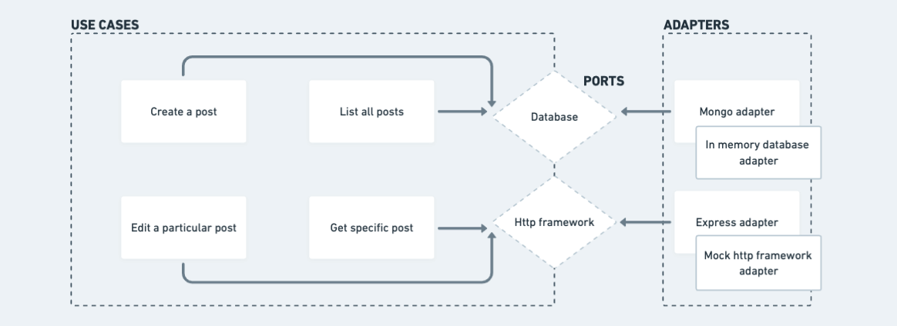

  <a href="https://mymenon.com.br">
    
    <h2 align="center">Hexagonal Architecture Distilled in JavaScript</h2>
  </a>

  The ultimate guide to understand Hexagonal Architecture (a.k.a Ports and Adapters) in JavaScript.

 

## Project Presentation

This is a simple blog project, with the most basic use cases we can have.

## Motivation and Disclaimers

This is a sample repository for my "Hexagonal Architecture Distilled in JavaScript" publication.

The code writing style was motivated by the familiarity of JavaScript programmers.

The design was as simple as possible in order not to obscure the practical examples of Hexagonal Architecture concepts.

I suggest that the consumer of this content does not get attached to peripheral concepts (Decorator design pattern, etc). Focus on Ports and Adapters.

## Arquitetural Map

This is an overview of the design and Hexagonal Architecture's look at it. 

It is not directly attached to any kind of UML diagram.

## How to Run

### Local:
- Install Node.js >= 14
- Open this repo and install dependencies
- Run `npm run start`

### Docker 🐳:
- Having the node installed, open this repo and run `npm run docker:up`
- If you want to disassemble the composition, run `npm run docker:down`

## // TODO

- [x] Implement the MongoDB adapter.
- [x] Implement the Express adapter.
- [x] Create Docker environment.
- [x] Create e2e Tests to View Results.
- [ ] Make a Markdown for each conceptual folder (usecases, ports, adapters) explaining every detail.
- [ ] Create the post itself, on my blog 😅.

