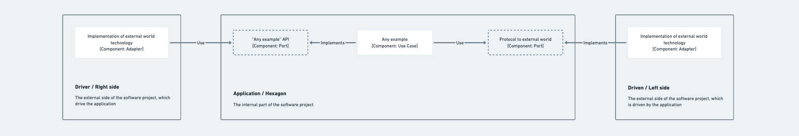

  <a href="https://pedromoraisf.medium.com">
    
    <h2 align="center">Hexagonal Architecture Distilled in JavaScript</h2>
  </a>

  The ultimate guide to understand Hexagonal Architecture (a.k.a Ports and Adapters) in JavaScript.

  <a target="_blank" href="https://javascript.plainenglish.io/hexagonal-architecture-distilled-in-javascript-ultimate-guide-aac2eaa6726c">Click here to see my publication on my blog →</a>

 

## Presentation

This is a sample repository for my "Hexagonal Architecture Distilled in JavaScript" publication.

The code writing style was motivated by the familiarity of JavaScript programmers.

The design was as simple as possible in order not to obscure the practical examples of Hexagonal Architecture concepts.

I suggest that the consumer of this content does not get attached to peripheral concepts (Decorator design pattern, etc). Focus on Ports and Adapters!

## Glossary

- <a href="./src/ports/readme.md">Ports - @/ports/readme.md</a>
- <a href="./src/adapters/readme.md">Adapters - @/adapters/readme.md</a>
- <a href="./src/usecases/readme.md">Use Cases - @/usecases/readme.md</a>

## Architectural Map of the Ports and Adapters

The diagram below is designed to be familiar with the C4 pattern component diagram.

## How to Run

#### Local:
- Install Node.js >= 14
- Open this repo and install dependencies
- Run: `npm run start`

#### Docker 🐳:
- Having the node installed, open this repo and run: `npm run docker:up`
- If you want to disassemble the composition, run: `npm run docker:down`

## How to Test

#### Unit and Integration:
- Unitary tests, run: `npm run test:unit`
- Integration tests, run: `npm run test:integration`
- Both tests, run: `npm run test`

#### e2e:
- Having the environment mounted (both local or docker), run: `npm run test:create-a-post` and copy the "_id" returned property
- Input above returned property in TESTABLE_POST_ID variable on e2e/docker/get-a-specific-post.test.js and run: `npm run test:get-a-specific-post`
- Input above returned property in TESTABLE_POST_ID variable on e2e/docker/edit-a-specific-post.test.js and run: `npm run test:edit-a-specific-post`
- Run: `npm run test:list-all-posts`
